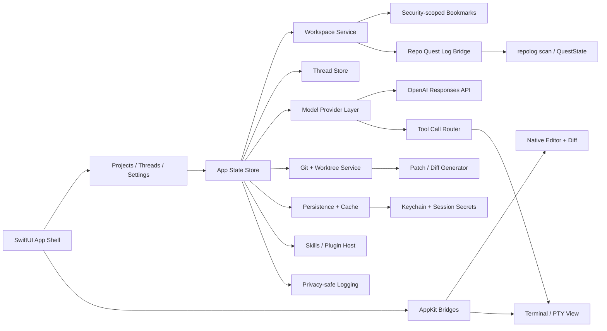
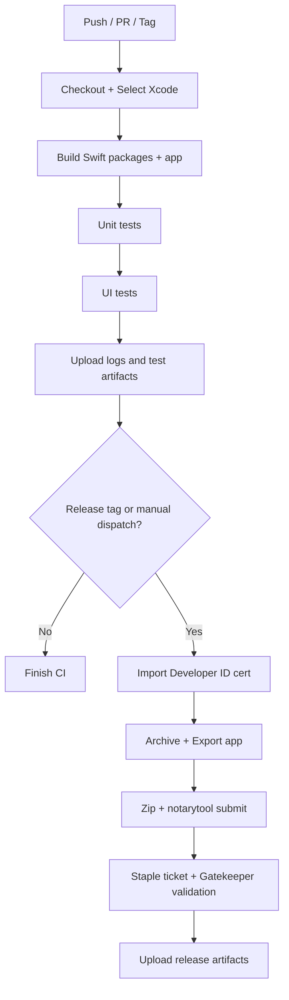

# plan_implementation.md

## Executive summary

The current `main` branch of `Statusnone420/Repo-Quest-Log` is **not** a native macOS app project. It is a TypeScript/Node codebase that already ships a CLI/TUI, a Windows Electron desktop host, and a VS Code extension. The repo PRD explicitly says the Windows desktop host is Electron, and it defers the macOS host decision to later work. The current `package.json` builds the desktop binary with Electron and `electron-builder --win --x64`, while `AGENTS.md` still treats `apps/desktop/**` as the Windows host. The existing root-level `plan_implementation.md` is already a live v0.4 execution spec referenced by `AGENTS.md`, so this new macOS plan should be saved under a **new path** such as `docs/macos/plan_implementation.md` or `plan_implementation_macos.md`; do **not** blindly overwrite the current root file. fileciteturn19file0L1-L1 fileciteturn12file0L1-L1 fileciteturn11file0L1-L1 fileciteturn13file0L1-L1 fileciteturn15file0L1-L1

Public OpenAI product pages describe the Codex app as a command center for **multiple agents in parallel**, with **project threads**, **diff review**, **built-in worktrees**, **skills**, **automations**, **git functionality**, shared history/configuration with the CLI and IDE extension, and approval-gated sandboxed execution. That makes this effort much larger than a simple port of the current Electron shell. Treat it as a **new product track inside the repo**, not a quick cosmetic rewrite of `apps/desktop`. citeturn0search0turn1search1turn15search1turn15search5

The recommended implementation path is a **Swift-first native macOS app** using **SwiftUI for the shell** and **AppKit where macOS-specific controls matter** most: code editing, diffing, terminal/PTY handling, advanced window behavior, and command routing. **Mac Catalyst** should remain an option, but it is optimized for bringing an existing iPad app to the Mac, and this repo does not have an iPad codebase. For distribution, ship **outside the Mac App Store first** with **Developer ID signing**, **Hardened Runtime**, and **notarization**. That path aligns much better with a Codex-like terminal/worktree app than a strict App Store sandbox. Apple documents that App Sandbox is required for Mac App Store submission, recommended outside the store, and that user-selected file entitlements do **not** allow running programs outside the app bundle or sandbox container. citeturn3search0turn3search2turn3search3turn3search7turn10search0turn10search3turn11search1turn2search0

| Decision area | Status | Working default for implementation |
|---|---|---|
| Target macOS version | **Unspecified** in the request and current repo docs | Make this a Phase 0 owner decision. If nobody decides, default to **macOS 14+** for v1 and revisit later. |
| UI framework | **Options required:** AppKit, SwiftUI, Catalyst | **SwiftUI shell + AppKit bridges**. Catalyst only if an iPad codebase appears later. |
| Language | **Swift preferred; others unspecified** | Assume **Swift** for all macOS targets. Allow a **small C shim** only if full PTY support demands it. |
| Offline mode | **Unspecified** | v1 guarantees cached UI state and local repo browsing offline. It does **not** imply offline model inference. |
| Distribution | **Unspecified** | **Developer ID direct distribution first**, App Store compatibility later if terminal/file constraints allow it. |
| Architecture | Requested as **modular, plugin-capable** | Use multiple Swift packages and strict protocol boundaries. |
| Existing repo reuse | Required by context | Reuse the current `repolog scan` / `QuestState` pipeline as a **bridge**, not as the final UI technology. |

## Repo context

The repo already has a strong “single shared state across multiple surfaces” idea. The PRD says v0.1 renders the HUD in a TUI, Windows desktop shell, and VS Code side panel over one shared `QuestState` contract, and the README documents `repolog scan` as JSON output. That is the best reuse point for a new native macOS app: phase 1 should consume the existing repo-legibility data through a **bridge** while new native features are built around it. fileciteturn12file0L1-L1 fileciteturn19file0L1-L1

The table below shows the files and directories that matter most to the macOS track.

| Path or pattern | What it does today | Native macOS implication |
|---|---|---|
| `PRD.md` | Product direction; says Windows Electron host shipped/closing out and macOS host decision is later work | Treat native macOS as a **new workstream**, not hidden existing work |
| `AGENTS.md` | Current repo operating rules; `apps/desktop/**` is still the Windows host; root `plan_implementation.md` is live | Save the new plan under a **new path** to avoid clobbering current execution instructions |
| `plan_implementation.md` | Existing live v0.4 theme/OpenRouter execution spec | Do not overwrite without explicit human approval |
| `package.json` | TypeScript/Electron/Vitest/Node 20+ build and packaging metadata | Current desktop build chain is **Windows/Electron only** |
| `src/engine/**` | Parser, normalizer, ranker, watcher, repo logic | Best initial reuse point via CLI/JSON bridge |
| `src/web/**` | Shared HTML/CSS renderer for desktop + VS Code | Transitional fallback if a temporary `WKWebView` bridge is ever needed |
| `src/desktop/**` | Desktop-root resolution and shell helpers | Preserve startup behavior in the new native app |
| `apps/desktop/**` | Electron main/preload/Desktop shell | Reference semantics only; do not treat as a native base |
| `extensions/vscode/**` | VS Code extension shell | Reuse concepts like prompt flows and context copy, not UI technology |
| `tests/**` and especially `tests/desktop.test.ts` | Existing product behaviors and acceptance expectations | Port equivalent behaviors into XCTest/XCUITest |
| Native Apple project files | No connected-repo evidence of `.xcodeproj`, `.xcworkspace`, `.entitlements`, or macOS `Info.plist` targets | The first macOS deliverable is the **workspace itself** |

The mapping above is derived from the repo PRD, current root plan, package metadata, desktop shell sources, and desktop tests. fileciteturn12file0L1-L1 fileciteturn13file0L1-L1 fileciteturn15file0L1-L1 fileciteturn11file0L1-L1 fileciteturn16file0L1-L1 fileciteturn20file0L1-L1 fileciteturn21file0L1-L1

The public Codex app feature set that matters for this plan is narrower than “everything OpenAI might do later.” The reviewed official sources consistently emphasize these capabilities: parallel agents, per-project threads, diff review, worktrees, skills, automations, git functionality, shared config/history with CLI/IDE, and secure-by-default command execution with approval rules. The feature map below turns those public descriptions into concrete build requirements for this repo. citeturn0search0turn1search1turn15search1turn15search5

| Public Codex app capability | What the new macOS app needs |
|---|---|
| Multiple agents in parallel across projects | A sidebar with projects/workspaces, agent threads, and per-thread status |
| Review diffs and open/edit changes locally | Native diff viewer plus editable file tabs |
| Built-in worktrees | A `GitWorktreeService` that creates isolated thread workspaces |
| Skills | A plugin/skill system that can package instructions, resources, scripts, and approvals |
| Automations | Background jobs as a later phase, not a day-one blocker |
| Git functionality | Branch, status, ahead/behind, commit log, worktree branch lifecycle |
| Shared configuration/history | Persistent thread history, settings, and last-opened workspace behavior |
| Secure-by-default execution | An approval policy for local shell/terminal actions, plus audit logs |

Two existing behaviors in the current desktop code are worth carrying forward exactly. First, startup repo resolution already prefers an explicit path, then a persisted last root, then the nearest ancestor with repo markers. Second, the current Electron host persists things like last root, window bounds, and first-run state. The native macOS app should preserve those semantics in `Application Support` rather than inventing new startup rules. fileciteturn20file0L1-L1 fileciteturn16file0L1-L1 fileciteturn21file0L1-L1

## Mac Mini setup and project opening

### Host preparation

Use the newest **stable Xcode version that your Mac mini can actually run**. Apple’s Xcode support matrix shows host-OS requirements for each Xcode release; for example, Xcode 16.4 requires macOS Sequoia 15.3 or later, while supporting deployment targets down to older macOS versions. Apple also documents that full Xcode includes tools like `xcodebuild` and `notarytool`; the standalone Command Line Tools package is useful when you do not install full Xcode, but it does not replace the full app for macOS archiving/notarization workflows. citeturn4search0turn12search0turn12search2turn12search3

Run this once on the Mac mini to get the machine into a sane developer state:

```bash
# If full Xcode is not installed yet, install it from the Mac App Store first.
# Then verify the active developer directory and tools.

xcode-select --print-path || true
sudo xcode-select --switch /Applications/Xcode.app
xcodebuild -version
```

If you want only the CLI tools first, or the machine prompts for them, this is the documented Apple bootstrap command:

```bash
xcode-select --install
```

Those commands follow Apple’s documented Command Line Tools installation and developer-directory selection flow. citeturn12search0turn12search3

### Current repo verification

Because the repo is currently a Node/TypeScript project, verify the existing codebase before creating any Apple-native target:

```bash
cd ~/Developer/Repo-Quest-Log

node -v
npm -v

npm ci
npm run build
npm test
```

The repo currently requires **Node 20+**, and its existing build/test path is centered on TypeScript, Vitest, Electron, and VS Code packaging. Verifying that path first protects you from building a new macOS target on top of an already-broken tree. fileciteturn11file0L1-L1

### What to open today

There is no native Xcode project to open yet. Today, you are opening **the repo folder**, not a Mac app target:

```bash
cd ~/Developer/Repo-Quest-Log
open -a Xcode .
```

That gives you code navigation and search across the repo while you create the new workspace. The first real Apple-native artifact should be something like:

```text
apps/macos/RepoQuestLogMac.xcworkspace
```

and once it exists:

```bash
open apps/macos/RepoQuestLogMac.xcworkspace
```

This “folder now, workspace later” flow is the only accurate opening instruction because the connected repo contains Windows/Electron desktop artifacts, not Apple-native project files. fileciteturn12file0L1-L1 fileciteturn11file0L1-L1 fileciteturn13file0L1-L1

### Permission model

Do **not** start by granting blanket Full Disk Access to everything. Apple’s file-access documentation gives you a cleaner path: for a sandboxed app, use `NSOpenPanel` or SwiftUI file importers to let the user select a repo folder, then persist access with **security-scoped bookmarks**. If phase 1 stays unsandboxed for direct distribution, still design the app around **user-selected workspace roots**, not silent full-disk crawling. citeturn11search1turn2search2turn11search2

For a Codex-like app, terminal behavior is the big permission fork. Apple explicitly documents that user-selected file entitlements do **not** allow a sandboxed app to run programs outside its bundle, sandbox container, or app group container, and it separately documents an embedded-helper-tool route for sandboxed apps. That means you should make the distribution decision early:

| Distribution mode | Recommended use here |
|---|---|
| Developer ID direct distribution, unsandboxed or selectively sandboxed | **Best v1 path** for terminal, worktrees, and flexible repo tooling |
| Full App Sandbox from day one | Accept only if terminal scope is narrow and possibly routed through a bundled helper tool |
| Mac App Store-first | Poor fit for the requested terminal/worktree feature set |

This recommendation comes directly from Apple’s sandbox and distribution documentation. citeturn11search1turn11search4turn11search5turn10search0turn10search3

## Architecture and project shape

### Framework choice

entity["company","Apple","cupertino, ca, us"] supports all three UI options you asked to evaluate, but they are not equal for this repo. SwiftUI gives you app lifecycle, menus/commands, and modern split-view navigation; AppKit gives you the mature macOS text, window, and interaction stack; Mac Catalyst is best when you already have an iPad app you are bringing to the Mac. Because this repo has no iPad client, the strongest default is **SwiftUI + AppKit**, not Catalyst-first. citeturn3search0turn3search2turn3search3turn3search4turn3search7turn3search8

| Option | Best use in this project | Strengths | Limits | Verdict |
|---|---|---|---|---|
| SwiftUI | App shell, settings, thread/project navigation, menu commands | Native app lifecycle, `NavigationSplitView`, commands, built-in accessibility, easy state-driven UI | Weakest area is advanced code-editing and terminal chrome | **Use as the primary shell** |
| AppKit | Code editor, terminal/PTY view, diff panes, advanced macOS windowing | Mature `NSTextView`, `TextKit`, deep macOS interaction model, strong localization/accessibility support | More verbose than SwiftUI | **Use where native depth matters** |
| Mac Catalyst | Only if an iPad app appears later | Fastest path from iPad app to Mac, default menu bar/keyboard/mouse support | Can use only AppKit APIs available to Catalyst; poor fit without an iPad codebase | **Keep as a fallback, not the main plan** |
| `WKWebView` bridge | Temporary rescue path if schedule pressure beats a native redraw | Can host the repo’s existing shared web renderer and interactive HTML | Not the best long-term answer for a “native macOS” requirement | **Use only as a transitional fallback** |

The strongest single case for AppKit is the editor. Apple still positions `NSTextView` as the principal macOS text object for rich editing, and `TextKit` gives the lower-level control you need for syntax highlighting, diff styling, and large-file layout. The right architecture is not “AppKit everywhere”; it is **SwiftUI hosting AppKit where native power matters most**. citeturn7search7turn7search8turn3search7

For web content, Apple’s own guidance is also clear: use `WKWebView` when web technologies satisfy layout/styling requirements more readily than native views. That makes `WKWebView` a valid fallback for the existing repo renderer, but not the preferred foundation for a long-lived native Codex-class app. citeturn7search0turn7search5

### Recommended module layout

The existing repo already has one shared contract idea (`QuestState`) across multiple surfaces. Keep that pattern, but upgrade the architecture for a larger agent app:

```text
apps/
  macos/
    RepoQuestLogMac.xcworkspace
    RepoQuestLogMac/
      App/
        RepoQuestLogMacApp.swift
        AppScene.swift
        Commands/
        Resources/
        Config/
          Debug.entitlements
          Release.entitlements
          Info.plist
Packages/
  RQLAppCore/
  RQLWorkspaceKit/
  RQLRepoBridgeKit/
  RQLModelKit/
  RQLThreadKit/
  RQLEditorKit/
  RQLTerminalKit/
  RQLGitKit/
  RQLAuthKit/
  RQLPersistenceKit/
  RQLPluginKit/
  RQLTelemetryKit/
  RQLAccessibilityKit/
Tests/
  macos/
    Unit/
    UI/
```

Use the packages like this:

| Module | Responsibility |
|---|---|
| `RQLAppCore` | Global app state, dependency injection, feature flags, command routing |
| `RQLWorkspaceKit` | Repo-folder selection, bookmarks, last-opened workspace, startup resolution |
| `RQLRepoBridgeKit` | Phase 1 bridge to the current `repolog scan` / `QuestState` output |
| `RQLModelKit` | Provider abstraction, OpenAI Responses transport, streaming, tool-call envelopes |
| `RQLThreadKit` | Projects, agents, thread metadata, message history, local caching |
| `RQLEditorKit` | Native code editor, syntax coloring, diff rendering, file tabs |
| `RQLTerminalKit` | Local shell runner, approval gating, PTY abstraction, audit logs |
| `RQLGitKit` | Status, branch/log, checkout, worktrees, patch generation |
| `RQLAuthKit` | Sign-in UX, keychain storage, session refresh, provider settings |
| `RQLPersistenceKit` | SQLite/JSON file caches, migrations, background writes |
| `RQLPluginKit` | Skills/plugin manifests, action routing, approval metadata |
| `RQLTelemetryKit` | Local logs, optional remote telemetry, privacy redaction |
| `RQLAccessibilityKit` | Accessibility identifiers, audit helpers, shared l10n/a11y rules |

### Architecture diagram



### Cross-cutting requirements

| Concern | Baseline rule |
|---|---|
| Telemetry and privacy | Default to **local-only logs** and opt-in remote analytics. Never upload repo contents, shells, prompts, or file bodies without explicit user action. |
| Accessibility | Keyboard-first navigation, VoiceOver labels, accessible diff/editor naming, Accessibility Inspector audit before release. |
| Performance | Lazy-load projects/threads, incremental diff rendering, background parsing, and profile large files + cold launch. |
| Security | Keychain for secrets, zero baked-in API keys, approval-gated shell, audit logs, signed/notarized release artifacts. |
| Dependencies | Prefer Apple frameworks first. Add third-party runtime libraries only when a native equivalent is too expensive to build safely. |
| Plugin model | Local manifest-driven skills first; do not start with remote arbitrary plugin downloads. |

Apple documents the native accessibility and inspection tooling you should use, and OpenAI explicitly warns that local shell execution is dangerous unless you sandbox it or add strong allow/deny rules and audit logging. OpenAI also recommends the **Responses API** for new agent-like integrations and documents streaming and conversation state there. Store secrets in the keychain rather than plain files. citeturn5search4turn5search10turn15search0turn14search2turn14search3turn16search5turn6search1turn6search3

## Implementation backlog

The backlog below is written so AI coding agents can execute it in order.

| Priority | Work item | Effort | Deliverable | Acceptance test |
|---|---|---|---|---|
| P0 | Create `docs/macos/plan_implementation.md` and `apps/macos/RepoQuestLogMac.xcworkspace` | Low | New docs path plus empty workspace committed without touching existing Electron targets | Repo still passes existing Node build/tests; workspace opens in Xcode |
| P0 | Bootstrap Swift packages and app target | Medium | App target plus package graph from the module layout above | `xcodebuild build` succeeds on macOS with no runtime features yet |
| P0 | Implement `RQLWorkspaceKit` | Medium | Open recent repo, persist last root, support explicit startup path, bookmark-based reopen | Relaunch restores the last-selected repo; explicit path wins over recent path |
| P0 | Implement `RQLRepoBridgeKit` using `repolog scan` | Medium | Native app can ingest current repo context from the existing CLI/JSON contract | Against this repo, app sidebar shows repo summary/objective without manual duplicate data entry |
| P0 | Build shell navigation in SwiftUI | High | Project sidebar, thread list, detail pane, settings panel, menu commands | XCUITest can open app, select a project, open settings, and return to thread detail |
| P0 | Define model/provider abstraction | High | `ModelProvider` protocol plus OpenAI-backed transport implementation | Unit test injects a fake provider and drives thread state without network |
| P0 | Add streaming chat UI | High | Token streaming, cancel, retry, thread persistence, tool-call state indicators | UI test sees partial output appear before completion and cancel stops the stream |
| P0 | Add `RQLAuthKit` and keychain-backed secrets | Medium | Provider settings, key entry, keychain persistence, logout/clear flow | No secret is written to plain-text settings files; key survives relaunch |
| P1 | Add git status and worktree service | High | Branch/status panel, create thread in isolated worktree, checkout cleanup rules | Creating a new agent thread produces a separate worktree and does not mutate primary HEAD |
| P1 | Add editor and diff viewer | High | Native file tabs, syntax-highlighted text view, diff review, save/reload | Opening a changed file shows syntax colors + staged/unstaged diff correctly |
| P1 | Add terminal/command runner | High | Local shell pane, approval modal, command output streaming, audit log | Denied commands do not execute; approved commands stream output and get logged |
| P1 | Add plugin/skill system | High | Local manifest format, enable/disable controls, policy metadata | A sample skill can inject instructions/resources and optionally expose a reviewed command |
| P1 | Add local caching and offline baseline | Medium | Thread cache, workspace cache, file tab restore, graceful offline state | Relaunch offline preserves history and repo browsing; network actions show explicit unavailable state |
| P1 | Add accessibility and keyboard coverage | Medium | Accessibility identifiers, labels, shortcuts, Inspector audit fixes | VoiceOver reads core controls; XCUITest reaches all major views via keyboard |
| P1 | Add privacy-safe telemetry | Medium | OSLog categories, redaction, opt-in analytics switch | Logs never include full file contents, raw API keys, or shell secrets |
| P1 | Add signing/notarization local scripts | Medium | Deterministic local release script and export options template | Local release script produces a signed archive ready for notarization |
| P2 | Add automations/background jobs | High | Scheduled or trigger-based tasks, background task state, cancellation | Background task survives app relaunch and presents clear run history |
| P2 | Add optional transitional `WKWebView` bridge | Medium | Only if native parity slips; hosts current shared renderer in a controlled feature flag | Fallback renders existing repo context without becoming the permanent main shell |
| P2 | Add auto-update path for direct distribution | Medium | Update feed support for Developer ID installs | App detects a staged test update without breaking notarization |

A few backlog items intentionally preserve existing repo truths instead of reinventing them. The bridge uses `repolog scan` because the README already documents it as JSON output; startup path behavior should match `src/desktop/root.ts`; and desktop-ish expectations can be ported from `tests/desktop.test.ts`. fileciteturn19file0L1-L1 fileciteturn20file0L1-L1 fileciteturn21file0L1-L1

## Build, packaging, and CI/CD

### Local build and run

Use the native workspace once created. Keep the default scheme names stable so AI agents and CI do not drift:

```bash
xcodebuild \
  -workspace apps/macos/RepoQuestLogMac.xcworkspace \
  -scheme RepoQuestLogMac \
  -configuration Debug \
  -destination 'platform=macOS' \
  build

xcodebuild \
  -workspace apps/macos/RepoQuestLogMac.xcworkspace \
  -scheme RepoQuestLogMac \
  -destination 'platform=macOS' \
  test
```

For release archives:

```bash
xcodebuild \
  -workspace apps/macos/RepoQuestLogMac.xcworkspace \
  -scheme RepoQuestLogMac \
  -configuration Release \
  -destination 'platform=macOS' \
  -archivePath build/RepoQuestLogMac.xcarchive \
  archive
```

Apple’s current notarization guidance requires `notarytool` or a modern Xcode workflow; `altool` and Xcode 13-era notarization are obsolete. Apple also requires valid Developer ID signing, Hardened Runtime, and secure timestamps for direct-distributed notarized apps. citeturn2search0turn10search0turn10search4

### Signing and notarization

Phase 1 should target **Developer ID outside the Mac App Store**. The packaging flow should be:

1. Archive the app.
2. Export a Developer ID-signed `.app`.
3. Zip the exported `.app`.
4. Submit that archive with `notarytool`.
5. Staple the notarization ticket.
6. Validate locally with Gatekeeper.

Example commands:

```bash
xcodebuild \
  -exportArchive \
  -archivePath build/RepoQuestLogMac.xcarchive \
  -exportPath build/export \
  -exportOptionsPlist apps/macos/ExportOptions-DeveloperID.plist

ditto -c -k --sequesterRsrc --keepParent \
  build/export/RepoQuestLogMac.app \
  build/RepoQuestLogMac.zip

xcrun notarytool submit build/RepoQuestLogMac.zip \
  --keychain-profile AC_NOTARY \
  --wait

xcrun stapler staple build/export/RepoQuestLogMac.app

spctl -a -vv build/export/RepoQuestLogMac.app
codesign -dvvv --entitlements - build/export/RepoQuestLogMac.app
```

That flow matches Apple’s direct-distribution guidance for Developer ID plus notarization. citeturn2search0turn10search0turn10search1turn10search3turn10search8

A minimal export options template should look like this:

```xml
<?xml version="1.0" encoding="UTF-8"?>
<!DOCTYPE plist PUBLIC "-//Apple//DTD PLIST 1.0//EN" "http://www.apple.com/DTDs/PropertyList-1.0.dtd">
<plist version="1.0">
<dict>
  <key>method</key>
  <string>developer-id</string>
  <key>signingStyle</key>
  <string>manual</string>
</dict>
</plist>
```

### CI flow

Pin the macOS runner image instead of relying on `macos-latest`. GitHub explicitly warns that `-latest` is the latest stable image GitHub provides, which may not be the newest OS version, and workflow YAML belongs in `.github/workflows`. Use **secrets** for signing and notarization material, not plain variables, because GitHub variables are unmasked in logs while secrets are encrypted and redacted. Upload archives, test results, and screenshots as workflow artifacts. citeturn9search2turn9search4turn9search5turn9search6



### GitHub Actions examples

Below is a minimal CI workflow.

```yaml
name: macos-ci

on:
  pull_request:
  push:
    branches: [main, develop, macos]

jobs:
  build-and-test:
    runs-on: macos-15

    steps:
      - uses: actions/checkout@v4

      - name: Show toolchain
        run: |
          xcodebuild -version
          swift --version

      - name: Resolve packages
        run: |
          xcodebuild -resolvePackageDependencies \
            -workspace apps/macos/RepoQuestLogMac.xcworkspace \
            -scheme RepoQuestLogMac

      - name: Build
        run: |
          xcodebuild \
            -workspace apps/macos/RepoQuestLogMac.xcworkspace \
            -scheme RepoQuestLogMac \
            -configuration Debug \
            -destination 'platform=macOS' \
            build

      - name: Test
        run: |
          xcodebuild \
            -workspace apps/macos/RepoQuestLogMac.xcworkspace \
            -scheme RepoQuestLogMac \
            -destination 'platform=macOS' \
            test

      - name: Upload test artifacts
        if: always()
        uses: actions/upload-artifact@v4
        with:
          name: macos-test-artifacts
          path: |
            ~/Library/Developer/Xcode/DerivedData/**/Logs/Test/*.xcresult
            ~/Library/Logs/DiagnosticReports/*
```

Store that as `.github/workflows/macos-ci.yml`, which is the location GitHub expects for workflow files. citeturn9search2turn9search6

Below is a release workflow template for signing and notarization.

```yaml
name: macos-release

on:
  workflow_dispatch:
  push:
    tags:
      - 'macos-v*'

jobs:
  release:
    runs-on: macos-15
    permissions:
      contents: write

    env:
      APP_NAME: RepoQuestLogMac
      KEYCHAIN_NAME: build.keychain-db

    steps:
      - uses: actions/checkout@v4

      - name: Create temporary keychain
        run: |
          security create-keychain -p "$APPLE_KEYCHAIN_PASSWORD" "$KEYCHAIN_NAME"
          security set-keychain-settings -lut 21600 "$KEYCHAIN_NAME"
          security unlock-keychain -p "$APPLE_KEYCHAIN_PASSWORD" "$KEYCHAIN_NAME"
          security list-keychains -d user -s "$KEYCHAIN_NAME"

      - name: Import Developer ID certificate
        run: |
          echo "$APPLE_DEVELOPER_ID_CERT_P12_B64" | base64 --decode > cert.p12
          security import cert.p12 \
            -k "$KEYCHAIN_NAME" \
            -P "$APPLE_DEVELOPER_ID_CERT_PASSWORD" \
            -T /usr/bin/codesign \
            -T /usr/bin/security

      - name: Store notarization credentials
        run: |
          xcrun notarytool store-credentials AC_NOTARY \
            --apple-id "$NOTARY_APPLE_ID" \
            --team-id "$APPLE_TEAM_ID" \
            --password "$NOTARY_APP_PASSWORD" \
            --keychain "$KEYCHAIN_NAME"

      - name: Archive app
        run: |
          xcodebuild \
            -workspace apps/macos/RepoQuestLogMac.xcworkspace \
            -scheme RepoQuestLogMac \
            -configuration Release \
            -destination 'platform=macOS' \
            -archivePath build/RepoQuestLogMac.xcarchive \
            archive

      - name: Export app
        run: |
          xcodebuild \
            -exportArchive \
            -archivePath build/RepoQuestLogMac.xcarchive \
            -exportPath build/export \
            -exportOptionsPlist apps/macos/ExportOptions-DeveloperID.plist

      - name: Zip, notarize, staple, validate
        run: |
          ditto -c -k --sequesterRsrc --keepParent \
            build/export/RepoQuestLogMac.app \
            build/RepoQuestLogMac.zip

          xcrun notarytool submit build/RepoQuestLogMac.zip \
            --keychain-profile AC_NOTARY \
            --keychain "$KEYCHAIN_NAME" \
            --wait

          xcrun stapler staple build/export/RepoQuestLogMac.app
          spctl -a -vv build/export/RepoQuestLogMac.app

      - name: Upload release artifact
        uses: actions/upload-artifact@v4
        with:
          name: RepoQuestLogMac-notarized
          path: |
            build/export/RepoQuestLogMac.app
            build/RepoQuestLogMac.zip
```

This workflow is intentionally explicit: runner pinned, secrets separated from variables, and artifacts preserved for debugging/reuse. citeturn9search2turn9search4turn9search5turn9search6

## Developer appendix

### Credentials and environment variables

Use the following matrix. Secrets belong in the macOS keychain locally and GitHub Actions **Secrets** in CI, not plain repo config files.

| Name | Secret | Used by | Notes |
|---|---|---|---|
| `OPENAI_API_KEY` | Yes | `RQLModelKit` local development only | Never hard-code or bundle in the app |
| `OPENAI_PROJECT` | Usually | Provider routing | Optional depending on account/project setup |
| `OPENAI_ORG` | Usually | Provider routing | Optional legacy/org scoping |
| `APPLE_TEAM_ID` | No | Xcode export + notarization | Safe as a variable |
| `APPLE_DEVELOPER_ID_CERT_P12_B64` | Yes | CI signing import | Base64-encoded `.p12` certificate |
| `APPLE_DEVELOPER_ID_CERT_PASSWORD` | Yes | CI signing import | Password for the `.p12` |
| `APPLE_KEYCHAIN_PASSWORD` | Yes | CI temporary keychain | Random per workflow/environment |
| `NOTARY_APPLE_ID` | Yes | `notarytool` auth path A | Use only if choosing Apple ID + app-password path |
| `NOTARY_APP_PASSWORD` | Yes | `notarytool` auth path A | App-specific password |
| `ASC_KEY_ID` | Yes | alternative notarization auth path B | Use App Store Connect API key path instead of Apple ID if preferred |
| `ASC_ISSUER_ID` | Yes | alternative notarization auth path B | Paired with API key |
| `ASC_PRIVATE_KEY` | Yes | alternative notarization auth path B | PEM private key |
| `SENTRY_DSN` | Yes | optional telemetry | Add only if product owner explicitly enables remote telemetry |
| `RQL_TELEMETRY_ENABLED` | No | feature toggle | Default should be `false` or absent |

OpenAI’s API docs explicitly warn not to expose API keys in client-side code, and Apple’s keychain docs make the keychain the correct storage choice for small secrets. In a distributable macOS app, that means either: user-supplied keys stored in Keychain, or a backend-issued session/token exchange. Do **not** ship a baked-in platform key. citeturn16search5turn16search8turn6search1turn6search3

### Agent operating rules

AI coding agents working on this track should follow these rules:

| Rule | Why |
|---|---|
| Create the native plan under `docs/macos/` or an equivalently isolated path | Root `plan_implementation.md` is already live for another workstream |
| Keep `apps/desktop`, `src/web`, and current Node flows intact until native parity is proven | The existing repo already ships useful surfaces |
| Reuse `repolog scan` in phase 1 instead of rewriting all repo-context logic first | Faster progress, lower risk, better alignment with existing repo behavior |
| Keep all new macOS code additive under `apps/macos/` and `Packages/` | Avoid destabilizing current Windows/Electron work |
| Never store secrets in `.repolog.json`, plain-text plist files, or checked-in config | Security |
| Keep approval gates around shell execution from day one | OpenAI’s local-shell guidance treats arbitrary command execution as high risk |
| Prefer protocol surfaces and dependency injection everywhere | The app must be modular and plugin-capable |
| Preserve existing startup semantics from `src/desktop/root.ts` | Current users already have a mental model for repo opening |

Those rules are grounded in the repo’s existing live execution docs and the current desktop code. fileciteturn13file0L1-L1 fileciteturn15file0L1-L1 fileciteturn20file0L1-L1 citeturn15search0

### Code snippets and test skeletons

Use these as starter templates.

A security-scoped bookmark helper:

```swift
import Foundation

enum WorkspaceBookmarkError: Error {
    case stale
    case accessDenied
}

func makeWorkspaceBookmark(for url: URL) throws -> Data {
    try url.bookmarkData(
        options: [.withSecurityScope],
        includingResourceValuesForKeys: nil,
        relativeTo: nil
    )
}

func withScopedWorkspace<T>(_ bookmarkData: Data, _ body: (URL) throws -> T) throws -> T {
    var isStale = false
    let url = try URL(
        resolvingBookmarkData: bookmarkData,
        options: [.withSecurityScope],
        relativeTo: nil,
        bookmarkDataIsStale: &isStale
    )

    guard !isStale else { throw WorkspaceBookmarkError.stale }
    guard url.startAccessingSecurityScopedResource() else {
        throw WorkspaceBookmarkError.accessDenied
    }
    defer { url.stopAccessingSecurityScopedResource() }

    return try body(url)
}
```

A provider abstraction that keeps the UI independent from any one model backend:

```swift
import Foundation

struct ModelRequest: Sendable {
    let threadID: UUID
    let messages: [ChatMessage]
    let tools: [ToolDescriptor]
}

enum ModelEvent: Sendable {
    case outputDelta(String)
    case toolCall(ToolInvocation)
    case completed(ModelResponse)
    case failed(String)
}

protocol ModelProvider: Sendable {
    func stream(_ request: ModelRequest) -> AsyncThrowingStream<ModelEvent, Error>
}
```

A simple shell policy shape:

```swift
struct ShellPolicy {
    var allowNetwork = false
    var blockedPrefixes: [String] = ["rm -rf /", "sudo ", "diskutil eraseDisk"]
    var requiresApproval: [String] = ["git push", "git reset --hard", "curl ", "ssh "]

    func decision(for command: String) -> ShellDecision {
        if blockedPrefixes.contains(where: { command.hasPrefix($0) }) { return .deny }
        if requiresApproval.contains(where: { command.hasPrefix($0) }) { return .prompt }
        return .allow
    }
}

enum ShellDecision {
    case allow
    case prompt
    case deny
}
```

A UI test starter:

```swift
import XCTest

final class WorkspaceOpenTests: XCTestCase {
    func testWorkspaceSelectionPersistsAcrossRelaunch() {
        let app = XCUIApplication()
        app.launchEnvironment["UITEST_MODE"] = "1"
        app.launch()

        app.buttons["openWorkspaceButton"].click()
        // Inject a fixture selection flow here.

        XCTAssertTrue(app.outlines["projectSidebar"].waitForExistence(timeout: 5))

        app.terminate()
        app.launch()

        XCTAssertTrue(app.outlines["projectSidebar"].waitForExistence(timeout: 5))
    }
}
```

A small acceptance matrix for QA:

| Area | Minimum test |
|---|---|
| Launch | First launch with no workspace shows onboarding and does not crash |
| Workspace access | User-selected repo reopens after relaunch |
| Repo bridge | This repo’s `PLAN.md` / `STATE.md` context shows up in native UI |
| Streaming | Partial model output appears before completion |
| Cancellation | Cancelling a model run stops further deltas |
| Git worktree | New thread can use isolated working tree without mutating main checkout |
| Terminal | Denied commands never execute; approved commands produce auditable logs |
| Editor | Opening a large file does not freeze the app |
| Accessibility | VoiceOver reads sidebar items and primary actions |
| Packaging | Exported release passes `spctl` and stapled notarization check |

Apple’s XCTest and XCUITest stack is the right base here, and macOS UI tests support keyboard and mouse interactions that map well to this app shape. Accessibility Inspector should be part of every release pass. citeturn5search0turn5search3turn5search4

## Risks and assumptions

| Risk or unknown | Why it matters | Mitigation |
|---|---|---|
| Root `plan_implementation.md` collision | The repo already uses that filename for an active v0.4 workstream | Save this plan under `docs/macos/` or a new filename |
| Product scope explosion | The current repo is a local-first repo-legibility tool, while the target is a Codex-class agent app | Phase delivery: bridge existing repo context first, then add agent features in layers |
| App Sandbox versus terminal/worktree behavior | Apple’s sandbox rules can clash with the requested shell/file-execution capabilities | Direct distribution first; sandbox later only if feature scope allows |
| Authentication model is not fully specified | “Authentication” was requested, but not whether that means API key, enterprise SSO, or a ChatGPT-linked flow | Ship `RQLAuthKit` behind a provider abstraction and start with user-supplied credentials or backend mediation |
| Code editor complexity | A truly native editor/diff view is much harder than a web editor embed | Use AppKit/TextKit from the start; keep a `WKWebView` fallback only as a schedule escape hatch |
| Existing repo docs disagree on test count | README still says 42 tests, AGENTS says 67 green | Treat code and CI as source of truth; do not trust stale counts |
| Telemetry and privacy drift | A Codex-like app can easily overcollect prompts, repo data, and shell logs | Default to local-only logging and explicit opt-in for remote analytics |
| Native and Electron divergence | Two desktop clients can become inconsistent fast | Freeze shared domain semantics in protocol contracts and golden acceptance tests |

The “active root plan” problem and the documentation mismatch are visible in the connected repo today: the current root `plan_implementation.md` is a live v0.4 execution spec, and repo docs disagree on current test counts. Agents should assume the codebase is the source of truth and audit before changing anything. fileciteturn15file0L1-L1 fileciteturn13file0L1-L1 fileciteturn19file0L1-L1

Assumptions for this plan are intentionally conservative. The target macOS version remains **unspecified** until the owner sets it. The language remains **Swift-first**. Offline mode remains **cache-only unless local inference is later requested**. Distribution starts as **Developer ID direct distribution**, not App Store. The new native app remains **additive** to the current repo until it proves parity on startup behavior, workspace selection, repo context ingestion, and local packaging.