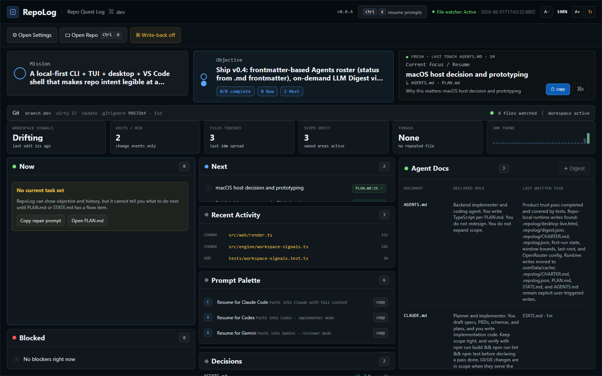

# RepoLog

You opened a repo. What were you doing?

RepoLog is a local-first desktop HUD for AI-assisted coding work. It reads your planning markdown (`PLAN.md`, `STATE.md`, `AGENTS.md`, `CLAUDE.md`, `GEMINI.md`) and answers the questions that decide whether you can resume in seconds:

- What is the current objective?
- What is the active task, and why was it current?
- What changed recently?
- What should I paste into Claude, Codex, or Gemini to restart cleanly?
- Is the workspace focused, drifting, or churning?

No account, backend, or repo mutation required for normal scanning. Optional Digest uses a user-supplied OpenRouter key and is off by default.



---

## Product Proof

RepoLog is designed around the daily "where was I?" moment, not around install docs.

| Question | Where RepoLog answers it |
|---|---|
| What was I doing? | Current Focus and Now show the resume task, source doc, and why it matters. |
| Why this task? | Objective, Resume Note, and task thoughts keep the reasoning next to the work. |
| What changed? | Recent Activity shows live file events; Recent changes keeps planning-doc/git context. |
| What do I paste into an agent? | Prompt Palette copies ready-to-paste resume, review, tuneup, and standup prompts. |
| Is this repo ready? | Workspace Signals show edit rate, files touched, scope drift, thrash, and trend. |

RepoLog does not claim "Codex is idle" or "Claude is working" unless that comes from the repo's own documents. The desktop app now treats agent files as **Agent Docs**: document, declared role, and last written task. Live status comes from observable workspace activity, not guesses.

---

## Product Tour

### Desktop HUD

The desktop app is the primary surface. It gives you a dense cockpit with Current Focus, Objective, Agent Docs, Workspace Signals, Now, Blocked, Recent Activity, Prompt Palette, and Digest.

### Workspace Signals

RepoLog watches lightweight file metadata in the opened repo:

- `edits/min`: `change` events in the last 60 seconds
- `files touched`: unique files touched in the last 10 minutes
- `scope drift`: files outside declared agent-owned areas
- `thrash`: repeated edits to the same file in the last minute
- `trend`: activity buckets for the last 30 minutes

The watcher ignores noisy directories such as `.git`, `node_modules`, `dist`, `build`, `.next`, `coverage`, caches, virtual envs, and configured excludes. It records path, event kind, timestamp, and scope flag only. It does not parse source files or read file contents.

### Prompt Palette

Press `Ctrl+K` to copy a clean resume prompt for Claude, Codex, Gemini, review, tuneup, or standup. The prompt is built from the same HUD state, so the clipboard matches what you are seeing.

### Tuneup and Digest

Tuneup scores whether the repo has enough markdown context for an agent to continue safely. Digest is an optional on-demand AI summary when you configure OpenRouter.

### CLI, TUI, and VS Code

The CLI, terminal HUD, and VS Code panel still use the same `QuestState` scan. They are secondary surfaces for scripting and editor-adjacent context; the desktop HUD is the product proof.

---

## Install

### Desktop app (Windows)
Download the latest installer from [GitHub Releases](https://github.com/Statusnone420/Repo-Quest-Log/releases):
- **`Repo Quest Log Setup <version>.exe`** — recommended, installs like any app
- **`Repo Quest Log <version>.exe`** — portable, run anywhere

> First launch may trigger Windows SmartScreen. That's expected for a new binary with low reputation — check the publisher name and file name before allowing.

### VS Code extension
```bash
code --install-extension repo-quest-log-0.5.0.vsix
```
Download the `.vsix` from the same release page, then run the command above.

### CLI (from source)
```bash
git clone https://github.com/Statusnone420/Repo-Quest-Log.git
cd Repo-Quest-Log
npm install
npm run build
npm link   # makes `repolog` available globally
```

---

## Surfaces

| Surface | Command |
|---|---|
| CLI scan (JSON) | `repolog scan .` |
| Live terminal HUD | `repolog watch .` |
| Desktop app (dev) | `npm run desktop:app` |
| Desktop app (build) | `npm run desktop:build` |
| VS Code extension (dev) | Open `extensions/vscode/` as extension-development folder |
| VS Code extension (package) | `npm run pack:vscode` |

---

## CLI Reference

```
repolog scan [path]               Parse repo and output QuestState as JSON
repolog watch [path]              Live terminal HUD (TUI), refreshes on file change
repolog status --short            One-line summary for shell status-line integrations
repolog doctor [path] [--json]    Diagnose missing headings, malformed config, empty buckets
repolog tuneup [path]             Score repo legibility (0-100), generate fix prompt for agents
  --write-charter                 Write .repolog/CHARTER.md
  --copy                          Copy prompt to clipboard
  --agent=claude|codex|gemini     Output agent-specific prompt
repolog prompt list               List available prompt presets
repolog prompt <id> [--copy]      Render a prompt preset (copy to clipboard with --copy)
repolog standup [--copy] [--json] Today's done + active tasks as markdown
```

---

## Keyboard Shortcuts (Desktop + TUI)

| Shortcut | Action |
|---|---|
| `Ctrl+K` | Prompt palette — 6 presets, copy to clipboard |
| `Ctrl+Shift+C` | Standup export — today's tasks as markdown, copied |
| `Ctrl+O` | Open repo folder picker (desktop) |
| `Ctrl+R` | Force refresh |
| `t` | Tuneup overlay — score bar + gap list (TUI) |
| `q` / `Esc` | Close overlay |

---

## Prompt Templates

Built-in presets are always available. Override per-user or per-repo:

- **User:** `~/.repolog/prompts/*.md`
- **Repo:** `.repolog/prompts/*.md` (wins over user)

Frontmatter fields: `id`, `label`, `sub`, `glyph`, `keywords`

Available template variables:
```
{{name}}  {{branch}}  {{mission}}  {{objective.title}}
{{objective.done}}  {{objective.total}}  {{resume.task}}
{{now}}  {{next}}  {{blocked}}  {{agents}}
```

---

## Repo Setup

RepoLog reads standard markdown files it finds in the repo root. No config required to get started.

| File | What it feeds |
|---|---|
| `PLAN.md` | Objective, Now / Next / Blocked task lists |
| `STATE.md` | Current focus, resume note, recent decisions |
| `AGENTS.md` / `CLAUDE.md` / `GEMINI.md` | Active agent roles, owned areas, activity feed when those tools are in use |
| `.repolog.json` | Optional: `writeback`, `prompts.dir`, `excludes` |
| `.repolog/CHARTER.md` | Agent onboarding doc (generate with `repolog tuneup --write-charter`) |

Heading patterns that the scanner recognises: `## Objective`, `## Now`, `## Next`, `## Blocked`, `## Mission`, `## Owned Areas`, `## Resume Note`. See [`docs/SCHEMA.md`](docs/SCHEMA.md) for the full spec.

---

## Repository layout

The root is kept for runtime entry points, package metadata, current planning state, and active agent-discovery files. Longer product notes, implementation plans, screenshots, archived handoffs, and design references live under [`docs/`](docs/README.md).

Retired agent instruction files belong in [`docs/Archived/agent-docs/`](docs/Archived/agent-docs/README.md). That keeps historical Claude/Gemini guidance available without letting unused tools shape active repo context.

---

## AI-assisted workflow

This project uses documented AI-assisted development workflows. Root files such as `AGENTS.md`, and optionally `CLAUDE.md` or `GEMINI.md` when those tools are active, define repo conventions, verification steps, and agent responsibilities. Archived tool docs are historical references, not runtime requirements.

---

## "Tune this repo" — Score and Fix

```bash
repolog tuneup
```

Scores your repo's markdown legibility from 0–100 across 8 checks (mission, objective, now-heading, agent owned areas, state resume note, plan next section, charter present, frontmatter). Outputs a targeted fix prompt you can paste directly into Claude, Codex, or Gemini.

```bash
repolog tuneup --write-charter   # generates .repolog/CHARTER.md
repolog tuneup --agent=claude    # Claude-specific prompt
```

The score also appears in the desktop Settings panel with a live coverage meter and one-click copy.

---

## Desktop: Open Any Repo

Press **Ctrl+O** (or File → Open Repo…) to point the app at any folder. The choice persists between sessions. You can also create a desktop shortcut to `Repo Quest Log.exe` and drag a folder onto it to open that repo directly.

---

## Building from Source

```bash
npm install
npm run build      # TypeScript compile
npm run lint       # type-check
npm test           # Vitest suite
npm run desktop:build   # Electron installer → release/
npm run pack:vscode     # VS Code .vsix → release/
```

---

## Contributing

Forks, pull requests, and alternate product directions are welcome. Please keep the copyright notice in the LICENSE.

---

## License

[MIT](LICENSE) — © 2026 Statusnone420
